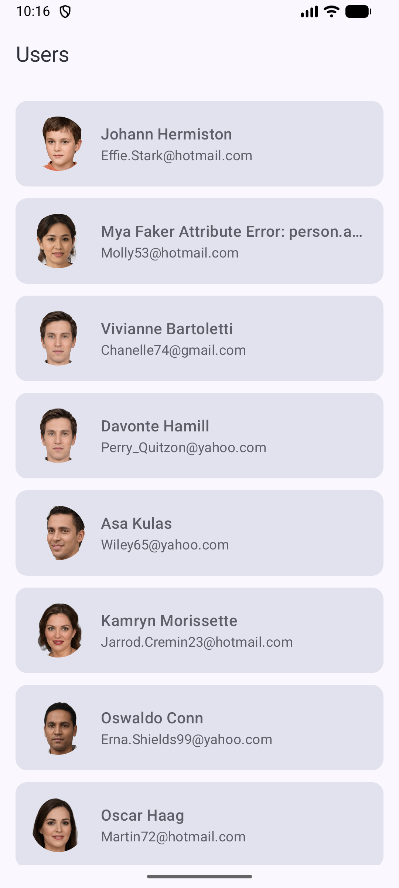
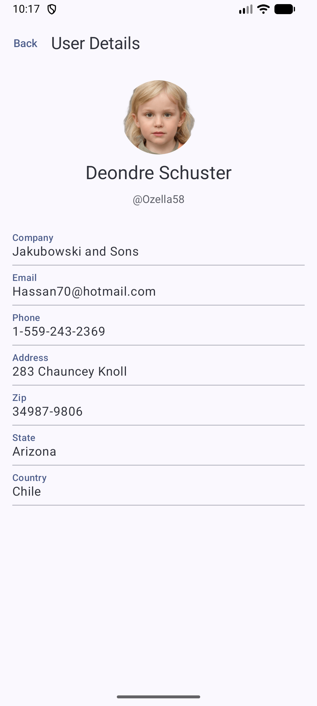
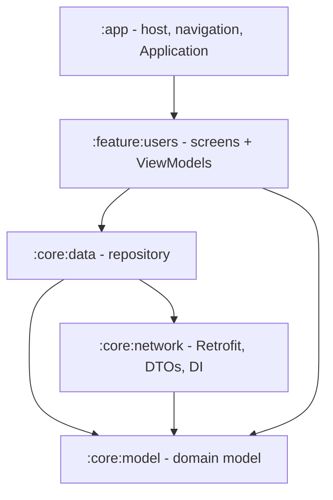

# UserApp – Users Directory

A small multi-module Android application that fetches a list of users from a sample REST
endpoint and shows a detail screen for each user. Built to demonstrate a clean, layered,
multi-module architecture even though the feature set is intentionally small.

## Features

- **Users list screen** – loads users from the network, shows avatar, name and email in a
  scrollable list, with loading and error/retry states.
- **User detail screen** – shows full details for a tapped user (company, email, phone,
  address, zip, state, country).
- **Offline-first persistent cache** – the last successfully fetched users are stored in a
  Room database. On relaunch (even after the app was killed) the previously stored data is
  shown **immediately**, then refreshed in the background and replaced when new data arrives.
- Reactive UI driven by `StateFlow` + Jetpack Compose.

## Screenshots & Video

<p>
  
</p>

| Users List | User Details |
| :---: | :---: |
|  |  |

## Tech stack

| Concern            | Choice                                                        |
| ------------------ | ------------------------------------------------------------- |
| Language           | Kotlin                                                        |
| UI                 | Jetpack Compose (Material 3)                                   |
| Architecture       | Multi-module, MVVM (UI → ViewModel → Repository → Api)         |
| Dependency Inject. | Hilt (Dagger)                                                 |
| Networking         | Retrofit + OkHttp (logging) + kotlinx.serialization converter |
| Persistence        | Room (offline-first cache, reactive `Flow` queries)           |
| Async              | Kotlin Coroutines + Flow                                      |
| Navigation         | Navigation Compose                                            |
| Image loading      | Coil                                                          |
| Testing            | JUnit4, MockWebServer, MockK, Turbine, coroutines-test        |
| Build              | Gradle (Kotlin DSL) + version catalog, KSP                    |

## Module structure



- **`:app`** – `UserApplication` (`@HiltAndroidApp`), `MainActivity`, and the `NavHost` that
  wires the list and detail destinations together.
- **`:core:model`** – framework-free `User` domain model.
- **`:core:network`** – `UsersApi` (Retrofit), `UserDto` + mapper, and the Hilt
  `NetworkModule` that provides Retrofit/OkHttp/Json.
- **`:core:data`** – `UsersRepository` abstraction and `UsersRepositoryImpl`, its Hilt
  binding, and the Room persistence layer (`CachedUserEntity`, `UsersDao`, `UserAppDatabase`,
  `DatabaseModule`). Owns the offline-first cache and the network refresh logic.
- **`:feature:users`** – `UsersListScreen`, `UserDetailScreen`, their ViewModels, UI state
  models, and the navigation graph.

## Caching strategy (offline-first)

The repository is the single source of truth and follows a stale-while-revalidate pattern:

1. **Read from disk first.** `UsersRepositoryImpl` exposes the cache as a hot
   `StateFlow<List<User>?>` backed by a Room `Flow`. `null` means "not read from disk yet"
   (a sub-frame window at process start); any list — even empty — means the cache has loaded.
2. **Warm at startup.** The repository is touched in `UserApplication.onCreate()` so the disk
   read starts during process init, *before* the first screen composes. This is why relaunch
   shows stored data immediately instead of a loader.
3. **Refresh in the background.** `refreshUsers()` fetches from the network and, on success,
   **atomically replaces** the cache in a single Room `@Transaction` (`replaceAll` = clear +
   insert). Because the UI observes the Room `Flow`, the write auto-emits and the list updates
   in place.
4. **Fail soft.** If a refresh fails while cached data exists, the cached data keeps showing
   (with a subtle top progress indicator during the fetch) — an error is only surfaced when
   there is nothing cached to display.

## API

List data comes from the sample endpoint:

```
GET https://fake-json-api.mock.beeceptor.com/users
```

## How to build & run

Requirements: Android Studio with a JDK 17+ toolchain and an Android SDK for the configured
compile SDK.

```bash
# Assemble the debug APK
./gradlew assembleDebug

# Run all unit tests
./gradlew test
```

Then run the `app` configuration on an emulator or device (needs internet access).

## Assumptions

- **Randomized mock data** – the Beeceptor endpoint returns a fresh, randomly generated list
  on every call, and there is **no single-user endpoint**. The detail screen therefore
  observes the persistent (Room) cache populated by the list fetch; on a cache miss (e.g. a
  deep link into a user that was never cached) it triggers a refresh and looks the user up by
  `id`.
- **Cache has no expiry** – the cache is treated as a display fallback, not a source of truth
  with freshness guarantees. Every launch triggers a refresh, and stored data is shown until
  it arrives. There is intentionally no TTL/staleness check.
- **Destructive migrations** – since the database is only a cache, schema changes use
  `fallbackToDestructiveMigration`; a version bump wipes and rebuilds the cache rather than
  writing a migration.
- **Loose wire contract** – because the mock data is random and can even contain faker error
  strings inside fields, every `UserDto` field is nullable/defaulted and coerced to a safe
  value in the mapper. No field is assumed to be present or well-formed.
- **Bleeding-edge toolchain** – the project was scaffolded with very recent AGP/Kotlin/Compose
  versions; the added libraries were chosen to be compatible with that toolchain.

## Possible improvements

- **Cache freshness** – add a TTL/`lastUpdated` timestamp so the app can skip the network when
  the cache is fresh, and show a "last updated" hint in the UI.
- **Pull-to-refresh** on the list screen (the refresh plumbing already exists in the ViewModel).
- **Richer error model** – distinguish connectivity, HTTP, and parsing errors with typed UI
  messaging instead of raw exception text.
- **Paging (Paging 3)** if the endpoint supported pagination, with `RemoteMediator` over Room.
- **Instrumented Room tests** – validate the DAO/`@Transaction` against real SQLite, plus
  Compose UI and screenshot tests.
- **Background sync** – refresh via `WorkManager` so data is up to date before the user opens
  the app.
- **Tooling** – a shared Gradle convention plugin to remove build-script duplication, and CI
  (lint, unit tests, assemble) on every pull request.
